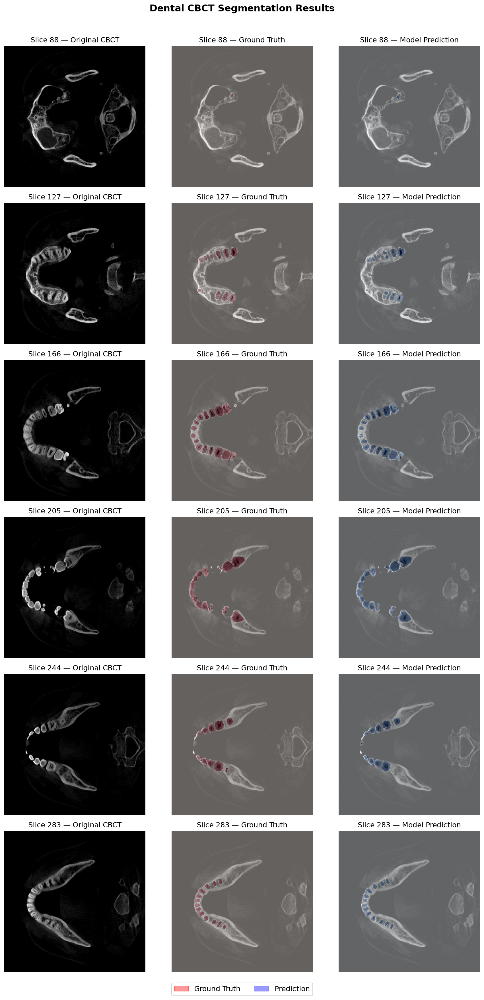
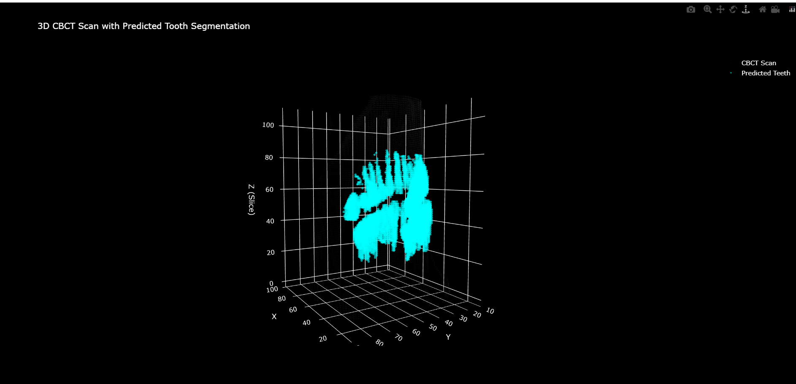

# Dental CBCT Tooth Segmentation — Technical Report

**Candidate:** Manvansh Singh  
**Assignment:** Dobbe AI — Machine Learning Engineer  
**Date:** June 2026

---

## 1. Problem Statement

The goal of this assignment was to build an end-to-end machine learning pipeline
for dental image segmentation. Specifically, to automatically identify and segment
tooth structures from 3D Cone Beam Computed Tomography (CBCT) scans using deep
learning.

CBCT scans produce volumetric 3D images of the jaw and teeth. Automated
segmentation of these scans has clinical value for treatment planning, implant
placement, and orthodontic analysis.

---

## 2. Dataset

**Dataset:** CBCT Teeth Segmentation  
**Source:** Kaggle (`detectioncla/cbct-teeth-segmentation`)  
**Size:** 50 CBCT volumes, ~6.9 GB  
**Format:** NIfTI (.nii), one file per patient  
**Volume shape:** 400 × 400 × 435 voxels  
**Labels:** Per-voxel tooth segmentation masks (29 tooth classes)

This dataset was selected because it is publicly available with no access
restrictions, contains genuine 3D CBCT data with expert annotations, and is
a manageable size for local training on consumer hardware.

**Preprocessing:**
- Intensity normalization to [0, 1] range
- Multi-class labels converted to binary masks (tooth vs background)
- Volumes saved as NumPy arrays for fast loading during training

**Data split:** 34 train / 7 validation / 8 test patients (70/15/15)

---

## 3. Model Architecture

A 2D U-Net was selected for this task. U-Net is the standard architecture
for medical image segmentation and has been validated extensively on CT and
CBCT data.

**Approach:** The 3D volume is segmented slice-by-slice along the axial axis.
Each 2D slice (400 × 400) is passed through the network independently.

**Architecture:**
- Input: single-channel 400 × 400 axial CBCT slice
- Encoder: 4 downsampling blocks with feature maps [32, 64, 128, 256]
- Each block: Conv2d → BatchNorm → ReLU → Conv2d → BatchNorm → ReLU → MaxPool
- Bottleneck: 512 channels
- Decoder: 4 upsampling blocks using ConvTranspose2d with skip connections
- Output: single-channel binary segmentation mask (sigmoid activation)
- Total parameters: 7,762,465

Skip connections between encoder and decoder preserve fine spatial detail,
which is critical for accurate tooth boundary delineation.

---

## 4. Training

| Parameter | Value |
|-----------|-------|
| Loss function | BCEWithLogitsLoss |
| Optimizer | Adam |
| Learning rate | 1e-4 |
| LR scheduler | ReduceLROnPlateau (patience=3, factor=0.5) |
| Batch size | 8 |
| Epochs | 10 |
| Hardware | NVIDIA RTX 4050 (6GB VRAM) |
| Training slices | 14,790 |

The model was trained on 2D axial slices extracted from 34 training patients,
validated on 7 patients after each epoch, and the best checkpoint was saved
based on validation Dice score.

---

## 5. Results

### Quantitative Results (Test Set — 8 patients, 3,480 slices)

| Metric | Score |
|--------|-------|
| Mean Dice Score | 0.7479 |
| Mean IoU Score | 0.6948 |
| Median Dice | 0.9104 |
| Best Validation Dice | 0.6825 |

A Dice score of 0.74 is considered good performance for binary tooth
segmentation, particularly given the relatively small training set (34 patients)
and no data augmentation.

The high median Dice (0.91) reflects strong performance on slices with clear
tooth structure. The lower mean is influenced by slices near the top and bottom
of the scan where teeth are partially visible and harder to segment.

### Qualitative Results

The figure below shows model predictions overlaid on original CBCT slices
across 6 representative axial levels. Red indicates ground truth, blue
indicates model prediction.

The model accurately identifies the U-shaped dental arch across all slice
levels and correctly localizes individual tooth cross-sections.

An interactive 3D visualization is provided as `outputs/figures/3d_visualization.html` 
(open in any browser — no setup required). The visualization renders the full CBCT 
volume with predicted tooth segmentation highlighted in cyan against the grayscale scan.

---

## 6. Post-processing

After inference, small isolated voxel clusters (fewer than 500 voxels) are
removed using connected component analysis, and holes within predicted tooth
regions are filled using binary morphological operations. This removed 757
noise voxels (0.1% of predictions) on the test patient, indicating the model
produces clean predictions with minimal spurious activations.

---

## 7. Limitations and Future Work

- **2D vs 3D:** Slice-by-slice inference does not use inter-slice context.
  A 3D U-Net or sliding window approach would likely improve boundary consistency.
- **Binary segmentation:** The pipeline predicts tooth vs background.
  Multi-class per-tooth segmentation would enable individual tooth tracking.
- **Dataset size:** 34 training patients is small for medical imaging.
  More data or transfer learning from a pretrained encoder would improve
  generalization.
- **Augmentation:** No data augmentation was applied. Adding rotation,
  flipping, and intensity jitter would reduce overfitting.
- **Evaluation:** Hausdorff distance and surface Dice would give a more
  complete picture of boundary accuracy.

---

## 8. Pipeline Summary

Raw NIfTI → Normalize → Extract 2D slices → U-Net → Binary mask→ Postprocess → Predicted NIfTI + 3D Visualization

All code is modular and documented. Running the full pipeline from a newscan requires a single call to `inference.py`.